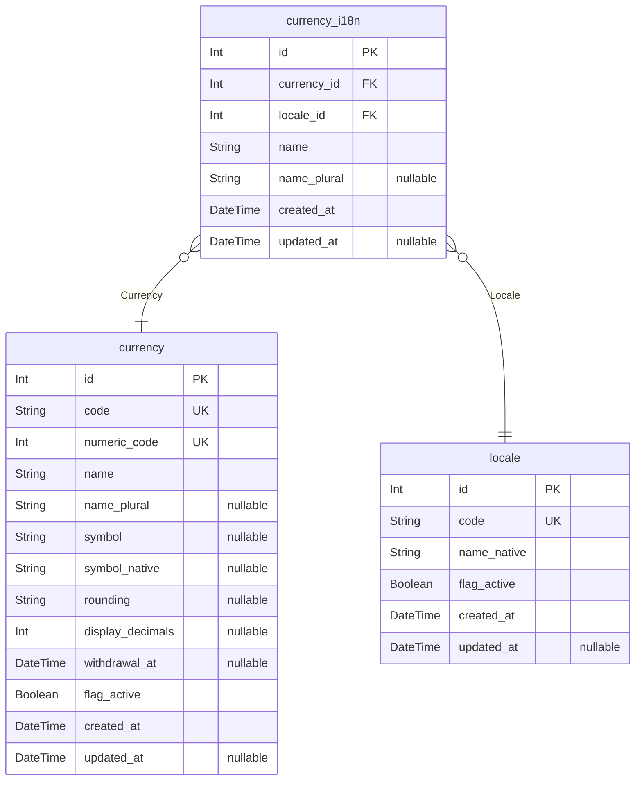

# Database docs
> Generated by [`prisma-markdown`](https://github.com/samchon/prisma-markdown)

- [default](#default)

## default

### `locale`
https://github.com/samchon/prisma-markdown

**Properties**
  - `id`: 
  - `code`: 
  - `name_native`: 
  - `flag_active`: 
  - `created_at`: 
  - `updated_at`: 

### `currency`

**Properties**
  - `id`: 
  - `code`: 
  - `numeric_code`: 
  - `name`: 
  - `name_plural`: 
  - `symbol`: 
  - `symbol_native`: 
  - `rounding`: 
  - `display_decimals`: 
  - `withdrawal_at`: 
  - `flag_active`: 
  - `created_at`: 
  - `updated_at`: 

### `currency_i18n`

**Properties**
  - `id`: 
  - `currency_id`: 
  - `locale_id`: 
  - `name`: 
  - `name_plural`: 
  - `created_at`: 
  - `updated_at`: 